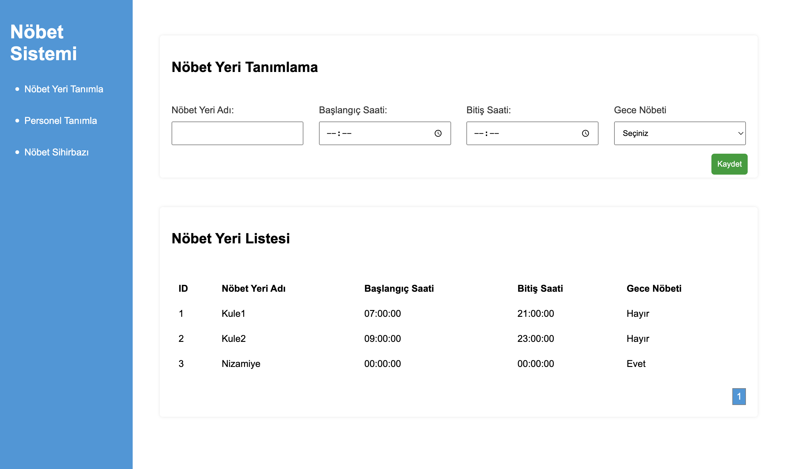
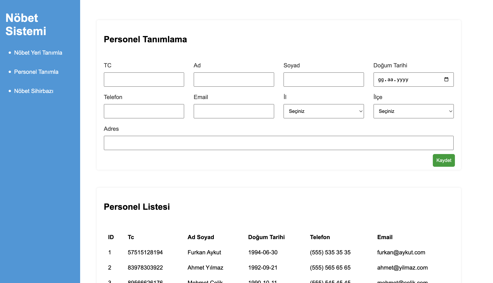
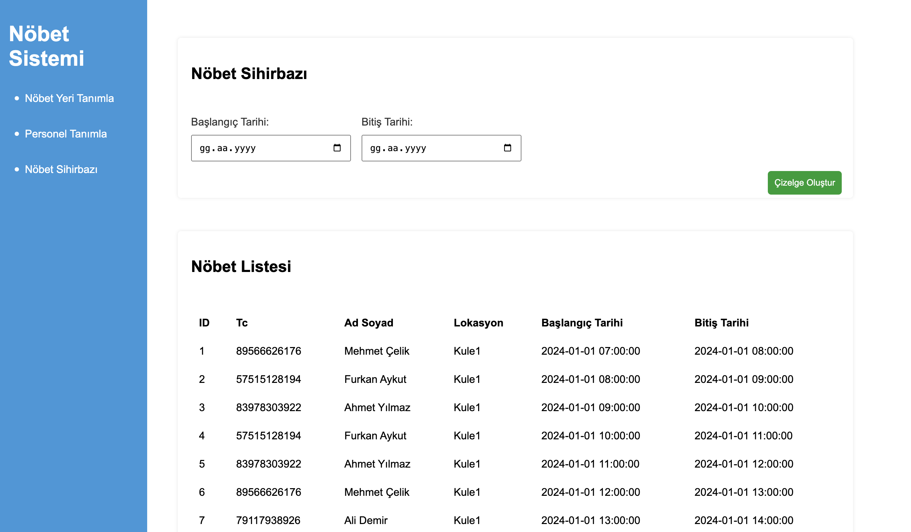

# Nöbet Sistemi

Bu proje, bir nöbet sistemi uygulamasını oluşturan PHP tabanlı bir web uygulamasıdır. Sistemin amacı, nöbet yerlerini tanımlamak, personeli tanımlamak ve nöbetleri atamak gibi temel nöbet yönetimi işlemlerini gerçekleştirmektir. Projenin kod yapısı modüler bir şekilde tasarlanmıştır, bu da projenin bakımını ve genişletilmesini kolaylaştırır.

## Kurulum

1. Projeyi bilgisayarınıza klonlayın veya ZIP dosyasını indirip çıkartın.
2. Bir web sunucusu (örneğin, Apache veya Nginx) kullanarak proje klasörünü yayınlayın.
3. Veritabanını oluşturmak için `database.sql` dosyasını kullanın.
4. `config.php` dosyasını açarak veritabanı bağlantı bilgilerinizi güncelleyin.

## Kullanım

1. Tarayıcınızda projenin ana dizinini açın (örneğin, `http://localhost/shift-system`).
2. Ana sayfada bulunan menüden istediğiniz işlemi seçin (Nöbet Yeri Tanımla, Personel Tanımla, Nöbet Sihirbazı).
3. Her bir işlem için gerekli bilgileri doldurun ve kaydet düğmesine basın.

## Ekran Görüntüleri

## Modüler Yapı

Proje, modüler bir yapıya sahiptir. Her bir modül kendi işlevselliğine sahiptir ve ana `index.php` dosyasında çağrılır.

- `define_shift.php`: Nöbet yerlerini tanımlama modülü.
- `define_personnel.php`: Personelleri tanımlama modülü.
- `define_shift_assignment.php`: Nöbetleri atama modülü.

Her modül, kendi veritabanı işlemlerini ve kullanıcı arayüzünü içerir.

## Veritabanı Yapısı

Proje, MySQL veritabanını kullanmaktadır. Veritabanı şeması aşağıdaki gibidir:

- `locations`: Nöbet yerlerini tutan tablo.
- `users`: Personel bilgilerini tutan tablo.
- `shift_assignments`: Nöbet atamalarını tutan tablo.

## Bağımlılıklar

Proje, [jQuery](https://jquery.com/) kütüphanesini kullanmaktadır. Bu kütüphane, ilçe bilgilerini getirmek için AJAX isteklerini yönetir.

## Geliştirme

Projeyi geliştirmek veya özelleştirmek için aşağıdaki adımları takip edebilirsiniz:

1. İlgili modül dosyalarını düzenleyin (örneğin, `define_shift.php`, `define_personnel.php`).
2. CSS dosyalarını güncelleyerek görünümü özelleştirin (`assets/css/style.css`).
3. İhtiyaca göre yeni modüller ekleyin veya mevcutları genişletin.
